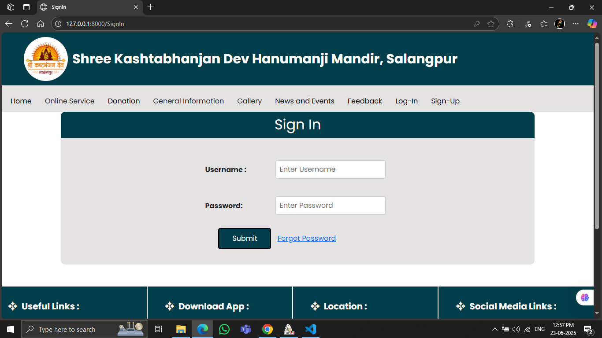
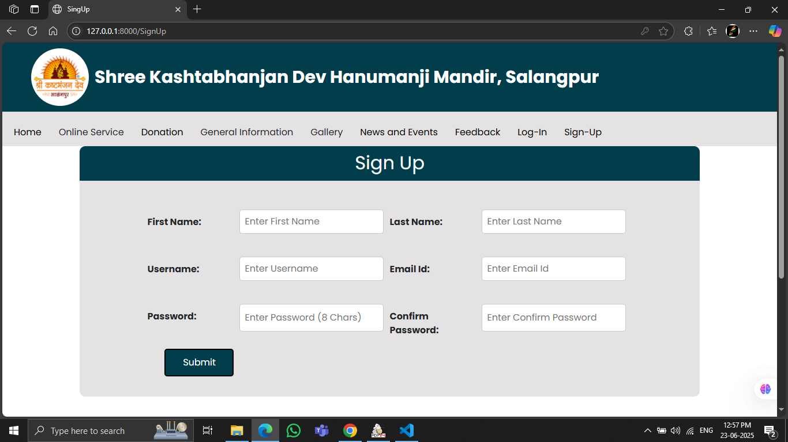
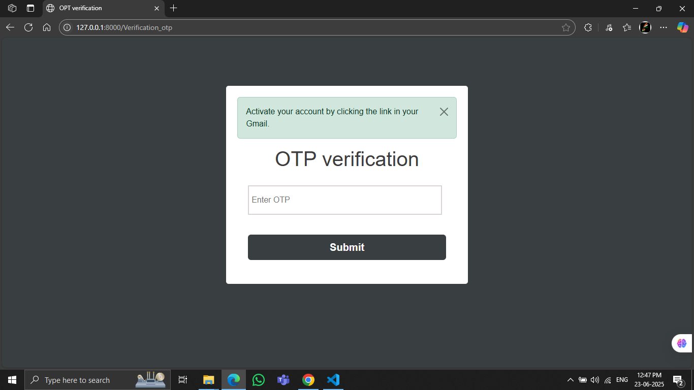
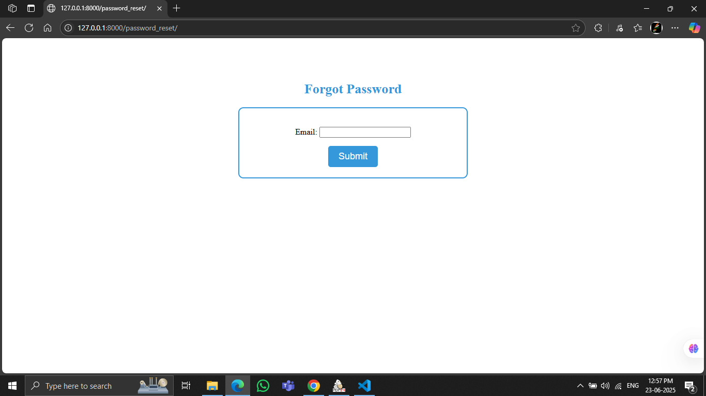
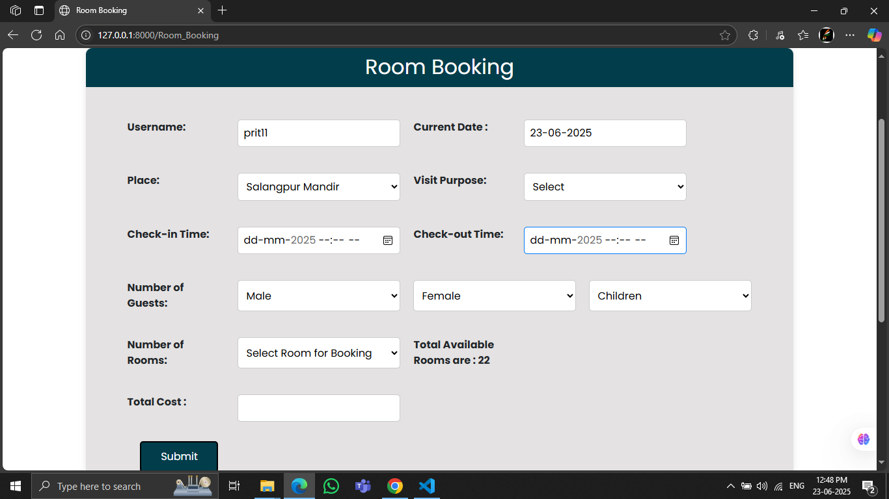
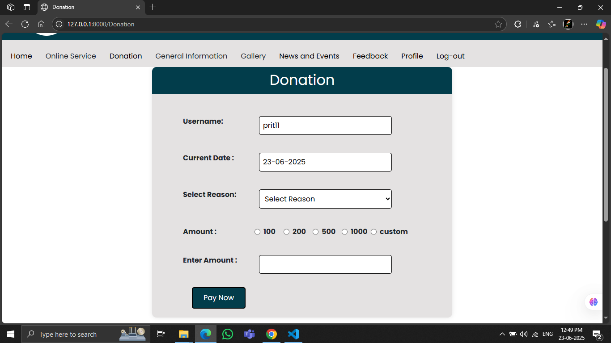
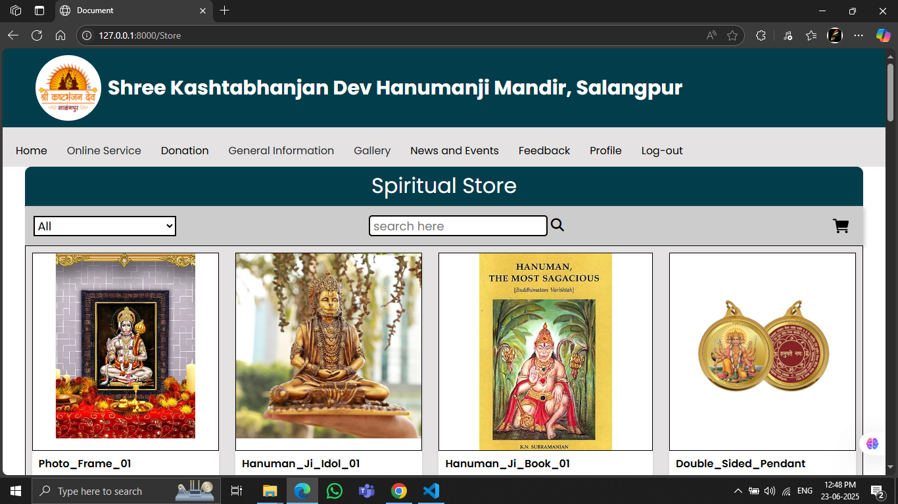
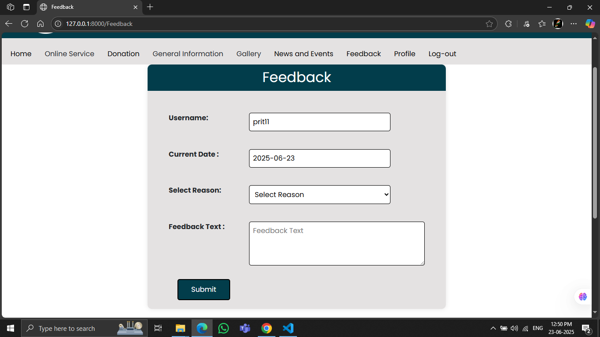
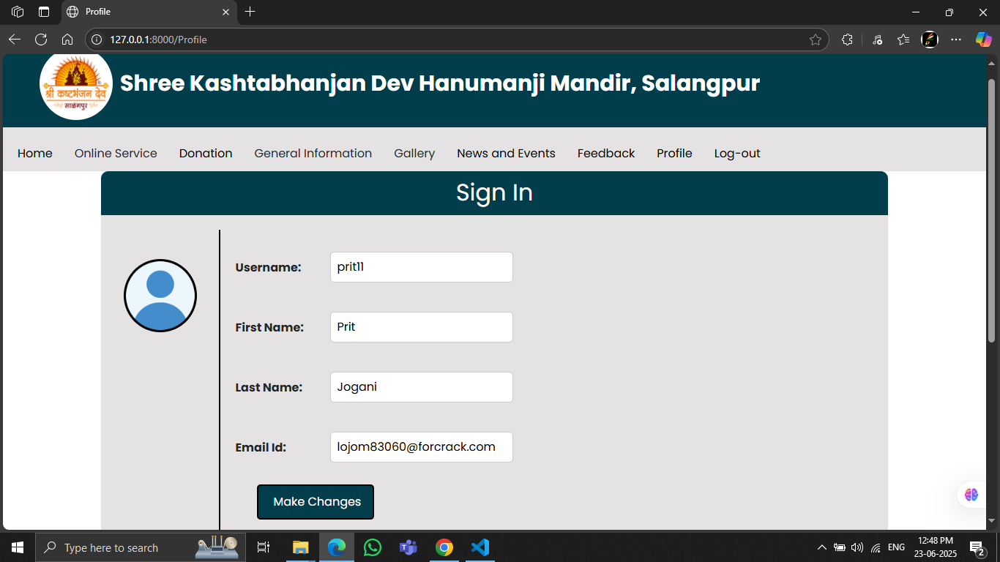
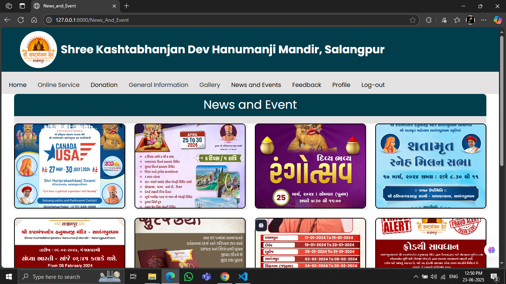

# 🛕 Temple Management System

A complete web-based solution to streamline temple administration, online room booking, donation handling, and spiritual store operations for **Shree Kashtabhanjan Dev Hanumanji Mandir** (Salangpur).

> 👨‍💻 Developed by:  
> - Jogani Prit Nayneshbhai (3117)  
> - Patel Raj Shaileshbhai (3141)  
> - Thakkar Nisarg Kiritbhai (3176)

## 📑 Table of Contents

- [Project Overview](#project-overview)
- [Features](#features)
- [Technologies Used](#technologies-used)
- [System Requirements](#system-requirements)
- [Installation Guide](#installation-guide)
- [Modules](#modules)
- [Screenshots](#screenshots)
- [Limitations](#limitations)
- [Future Scope](#future-scope)
- [Contributing](#contributing)

---

## 📌 Project Overview

The **Temple Management System** is designed to address inefficiencies in the traditional management system used by the temple. It enables digital room booking, donation handling, online order processing, and communication between devotees and temple staff. It helps devotees interact remotely with temple services, which historically required physical presence.

---

## ✨ Features

- 🔒 User Registration & Secure Login
- 📅 Online Room Booking
- 💳 Online Donation System with Categories
- 🛍️ Spiritual Store (Idols, Books, Pendants)
- 📢 Event & News Management
- 📊 Admin Dashboard with Analytics & Reports
- 📬 Feedback and Customer Support
- 📂 Inventory Management
- 🔐 Data Privacy and Secure Transactions

---

## 🧰 Technologies Used

- **Frontend:** HTML5, CSS3, JavaScript  
- **Backend:** Python (Django Framework)  
- **Database:** SQLite  
- **Server:** Apache (localhost for development)  
- **Payment Gateway:** Razorpay (test mode)  
- **Diagramming:** UML (Use-Case, Activity, Class, Sequence)

---

## 💻 System Requirements

### Client Side
- OS: Windows 7 or higher  
- Browser: Chrome (v109.0+) or Firefox (v115.0+)  
- Hardware: Core i3+, 2GB+ RAM, 4GB+ HDD

### Server Side
- OS: Windows/Linux  
- Server: Apache  
- Hardware: Core i3+, 4GB+ RAM, 16GB+ HDD  
- Database: SQLite  

---

## ⚙️ Installation Guide

1. **Clone the repository**

   git clone https://github.com/prit2609/Temple-Management-System.git
   cd temple-management-system

2. **Create a virtual environment**
  python -m venv venv
  source venv/bin/activate  # On Windows: venv\Scripts\activate

3. **Install dependencies**
  pip install -r requirements.txt

4. **Run migrations**
  python manage.py makemigrations
  python manage.py migrate

5. **Run the server**

   python manage.py runserver

7. **Visit**: http://127.0.0.1:8000

📦 Modules
  🙍‍♂️ User Panel:
    
    Register/Login
    
    View Events, News, Rituals
    
    Donate Online
    
    Book Temple Rooms
    
    Purchase from Spiritual Store
    
    Give Feedback

  🛠️ Admin Panel:
    
    Manage Users, Donations, Bookings    
    Inventory & Order Management    
    View Feedback
    Generate Reports

  🖼️ Screenshots

    ### 🏠 Home Page
    
    
    
    

    ### 🛏️ Login
    

    ### 🛏️ Register
    
    
    
    
    ### 🛏️ Login
    

    ### 🛏️ Room Booking
    

    ### 💰 Donation
    

    ### 🛍️ Spiritual Store
    
    

    ### 💰 Feedback
    

    ### 💰 Profile
    

    ### 💰 Photo Galary
    

    ### 💰 News and Alert
    

  ⚠️ Limitations

    Room booking updates are not reflected after checkout.
    Limited product availability in the store.
    No Cash on Delivery (COD) option.
    Basic payment options only (no UPI or international methods).
    Basic shipping (no live tracking).

  🔮 Future Scope
    🔐 Biometric or facial recognition login
    
    📊 Advanced analytics with AI/ML
    🌐 Social media integration for event promotion
    📦 Real-time inventory & shipping tracking
    🔁 Automation for volunteer/event/resource management
    📱 Mobile App version for Android/iOS

  🤝 Contributing
    
    Want to contribute? Great! Fork this repo and raise a pull request.

  📧 Contact
    For queries or collaboration:
    📨 templemanagementsystem66@gmail.com
